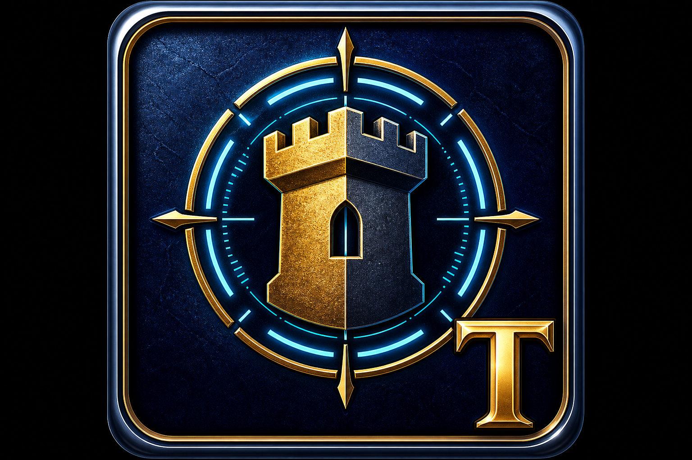

<p align="center">
  
</p>

<h1 align="center">Trinker 3.0 — Your Personal Age of Empires 2 Build Order Coach & Replay Analyst</h1>

<p align="center">
  <strong>Stop guessing your feudal time. Start training with purpose.</strong><br>
  A desktop companion for <em>Age of Empires II: Definitive Edition</em> — overlay build orders, replay insights, and optional local AI coaching.
</p>

<p align="center">
  <a href="https://github.com/zakksu/Trinker/releases"></a>
  <a href="https://github.com/zakksu/Trinker/actions/workflows/ci.yml"></a>
  
  
</p>

---

## Why Trinker?

**Age of Empires II** rewards muscle memory — villager counts, timing windows, and clean transitions decide games long before the first fight. Trinker sits beside your match (not inside the game files) and helps you **practice the right build**, **track what actually happened**, and **close the gap** between plan and execution.

Whether you are learning your first Meta Knight rush or tightening a 22-pop archer build, Trinker keeps the checklist visible, the data honest, and the feedback actionable.

---

## Features

| | |
|---|---|
| 📋 **Build order overlay** | Step-by-step checklist on top of your game — hotkeys, timers, and progress at a glance |
| 📚 **Build library** | Starter orders for common openings; import, edit, and organize your own |
| 📊 **Dashboard & analytics** | Session history, timing trends, win-rate views, and compare-to-build diffs |
| 🎬 **Replay analysis** | Import `.mgz` replays — feudal/castle times, economy snapshots, post-game summaries |
| 🤖 **AI Coach (optional)** | Local Ollama integration — ask questions, get tips, no cloud required |
| 📖 **RAG knowledge base** | Built-in AoE2 guides injected into coach prompts (feudal timing, economy, scout rush) |
| 🎯 **Training Arena** | Pin drills, get suggestions from your stats, practice with focused goals |
| ⌨️ **Global hotkeys (Windows)** | Toggle overlay and step through builds while AoE2 has focus |
| 🃏 **Library card view** | Browse build orders as cards or table — pick what fits your workflow |
| 🌐 **Online profile hook** | Pull recent ladder matches via aoe2.gg integration (when APIs are available) |
| 🔔 **Smart notifications** | Milestone toasts, streak tracking, and gentle nudges when you drift off plan |
| ⚙️ **Offline-first** | SQLite storage under your user profile; your data stays on your machine |
| 🔄 **Auto-update friendly** | Windows launchers pull latest code or release builds from GitHub |

---

## Screenshots

> **Coming soon** — GIFs and screenshots will live here after the v2.1 UI polish lands.

| Dashboard | Overlay | Replay analysis |
|:---:|:---:|:---:|
| *placeholder* | *placeholder* | *placeholder* |

### How to capture great promo media (Windows)

1. **Install a recorder** — [ShareX](https://getsharex.com/) (free) or OBS Studio.
2. **Set resolution** — Record at 1920×1080; crop to the Trinker window or a 1280×720 region.
3. **Overlay demo** — Launch AoE2 DE (or desktop), open Trinker overlay (`Ctrl+Shift+O` by default), step through a build order for 15–30 seconds.
4. **Dashboard demo** — Import 2–3 replays, open **Dashboard**, scroll stats and compare sections.
5. **Export** — Save as `.gif` (ShareX → **Capture → Screen recording → GIF**) or `.mp4` for GitHub README embedding.
6. **Add files** — Put assets in `docs/screenshots/` and replace the placeholders above with:
   ```markdown
   
   ```

---

## Quick start

### Windows (recommended)

**First time only:**

1. Install [Python 3.11+](https://www.python.org/downloads/) — tick **“Add Python to PATH”**.
2. Clone or download this repo anywhere (e.g. `C:\Games\Trinker\`).
3. Double-click **`INSTALL_WINDOWS.bat`** — installs dependencies and seeds starter build orders.

**Every session:**

| Launcher | What it does |
|----------|----------------|
| **`LAUNCHER.bat`** | Retro launcher UI + optional update check |
| **`UPDATE_AND_RUN.bat`** / **`TRINKER.bat`** | `git pull`, refresh data, then start |
| **`UPDATE_EXE.bat`** | Download latest `TRINKER.exe` from GitHub Releases, then run |
| **`dist\TRINKER.exe`** | Standalone build — no Python required |

> **Tip:** Your practice data lives in `%LOCALAPPDATA%\TRINKER\` — safe when you move or update the app folder.

See also: [`README_WINDOWS.txt`](README_WINDOWS.txt) for troubleshooting and AI Coach setup.

### Linux & macOS

```bash
git clone https://github.com/zakksu/Trinker.git
cd Trinker
chmod +x run_trinker.sh
./run_trinker.sh
```

`run_trinker.sh` creates a `.venv`, installs dependencies, seeds builds, prints your data folder, and launches the app.

Manual equivalent:

```bash
python3 -m venv .venv
source .venv/bin/activate          # macOS/Linux
pip install -r requirements.txt
python seed_builds.py
python main.py
```

**Data directory:** resolved via `platformdirs` (typically `~/.local/share/TRINKER` on Linux, `~/Library/Application Support/TRINKER` on macOS).

---

## Installation (developers)

```bash
git clone https://github.com/zakksu/Trinker.git
cd Trinker
python -m venv .venv

# Windows
.venv\Scripts\activate
# macOS/Linux
source .venv/bin/activate

pip install -r requirements.txt
pip install pre-commit && pre-commit install   # optional hooks
pytest tests/ -q
python main.py
```

### Optional: AI Coach

1. Install [Ollama](https://ollama.ai).
2. Run the setup helper (pulls the recommended model):
   ```bat
   python scripts/setup_ollama.py
   ```
   Or manually: `ollama pull llama3.2`
3. In Trinker → **Settings → AI Coaching** → enable, turn on **RAG knowledge base** if you want guide snippets in prompts, and **Test Connection**.

If Ollama is offline, Trinker falls back to static tips — no crash, no cloud.

### Optional: standalone executable (Windows)

```bat
BUILD_EXE.bat
```

Output: `dist\TRINKER.exe` — built with PyInstaller (`trinker.spec`).

---

## Usage

1. **Start Here** — Pick a build order and launch the overlay.
2. **Training** — Pin a drill or accept a suggested focus for your next session.
3. **Play** — Follow steps; use hotkeys shown in the overlay footer (global hotkeys on Windows when enabled in Settings).
4. **Import replay** — After the match, import your `.mgz` from the AoE2 DE savegame folder.
5. **Dashboard** — Review timings, compare execution vs. the planned build, ask the AI Coach.
6. **Library** — Edit, duplicate, or import community build orders (`.json`); switch between table and card views.

**Default hotkeys** (customizable in Settings):

| Action | Default |
|--------|---------|
| Toggle overlay | `Ctrl+Shift+O` |
| Next step | `Ctrl+Shift+N` |
| Previous step | `Ctrl+Shift+P` |

On **Windows**, enable **Global hotkeys** in Settings to use these while AoE2 has focus. On macOS/Linux, Trinker must be focused (or use the in-app shortcuts).

---

## Roadmap

| Version | Focus |
|---------|--------|
| **v2.0** ✅ | Compare-to-build, Ask Coach chat, aoe2.gg hook, CI pipeline |
| **v2.1** ✅ | Medieval dark UI, dashboard cards, overlay polish |
| **v2.2** ✅ | Win-rate heatmaps, streak badges, cross-platform CI + platformdirs |
| **v2.3** ✅ | Expanded pytest-qt suite, replay corpus tests, E2E CI flows |
| **v3.0** ✅ | Training Arena, RAG coach, global hotkeys, library cards, plugin hooks |
| **v3.1** ✅ | Civ skins, drill progress, telemetry, OCR wiring, simulation stub, practice tab |
| **Future** | Replay corpus downloads (public URLs), signed releases, macOS/Linux global hotkeys |

Track progress in [GitHub Issues](https://github.com/zakksu/Trinker/issues) and [Releases](https://github.com/zakksu/Trinker/releases).

---

## Tech stack

| Layer | Choice |
|-------|--------|
| UI | **PySide6** (Qt6), custom QSS themes |
| Storage | **SQLite** + local JSON settings |
| Replays | **mgz** parser (DE replays; version gaps handled gracefully) |
| Charts | **matplotlib** |
| AI | **Ollama** HTTP API (local LLM) |
| Packaging | **PyInstaller**, GitHub Actions |
| Quality | **pytest**, **ruff**, **pre-commit** |

---

## Contributing

Contributions welcome — bug reports, build orders, docs, and code.

1. **Fork** the repo and create a branch (`feat/my-improvement`).
2. **Install** dev dependencies and run checks:
   ```bash
   pip install -r requirements.txt
   ruff check src tests
   pytest tests/ -q
   ```
3. **UI / E2E tests** (headless Qt on Linux CI; optional locally):
   ```bash
   # Windows PowerShell
   $env:QT_QPA_PLATFORM="offscreen"
   pytest tests/test_ui_smoke.py tests/test_e2e_flows.py -q

   # Replay corpus regression (synthetic replays, no network)
   python scripts/replay_corpus_test.py
   ```
4. **Keep PRs focused** — one feature or fix per pull request.
5. **Preserve offline behavior** — no required cloud services.
6. Open a **Pull Request** against `main` with a short test plan.

**Good first issues:** UI screenshots, build order JSON, replay edge cases, docs improvements.

---

## Project layout

```
Trinker/
├── main.py              # App entry point
├── launcher.py          # Retro launcher window
├── src/
│   ├── ui/              # Tabs, overlay, themes
│   ├── build_orders/    # Library, timers, importers
│   ├── replay/          # mgz parsing & analysis
│   ├── analytics/       # Sessions, compare, history
│   ├── ai_coach/        # Ollama prompts & chat
│   └── core/            # Config, DB, hotkeys
├── tests/               # pytest suite
├── assets/              # Icons & branding
└── scripts/             # Import, rebuild, release helpers
```

---

## Social preview image (GitHub)

GitHub shows a **social preview** when the repo link is shared on Discord, Twitter/X, etc.

**Recommended setup:**

1. Create a **1280 × 640 px** banner (PNG or JPG):
   - Dark parchment/wood background (match Trinker UI)
   - Centered `assets/trinker_icon.png` logo
   - Title: **“Trinker — AoE2 Build Order Coach”**
   - Subtitle: *Overlay · Replays · Local AI Coach*
2. Save as `docs/social-preview.png` in the repo (optional but keeps it versioned).
3. On GitHub: **Repository → Settings → General → Social preview → Upload**.

Until a custom banner exists, GitHub may use the README hero image or the repo’s default icon.

---

## Repository topics (GitHub metadata)

Add these topics so players and developers can discover Trinker:

`age-of-empires-2` · `aoe2` · `build-order` · `training-tool` · `overlay` · `replay-analysis` · `python` · `qt` · `ai-coach`

*(See beginner steps below if you haven’t set these yet.)*

---

## License

No license file is published yet — treat the repo as **source-available for personal use** until a formal license is added. Open an issue if you need clarification for redistribution.

---

## Acknowledgements

Built for the AoE2 DE community. Not affiliated with Microsoft, Xbox Game Studios, or Forgotten Empires.

**Enjoy your games — may your feudal be on time.** 🏰
